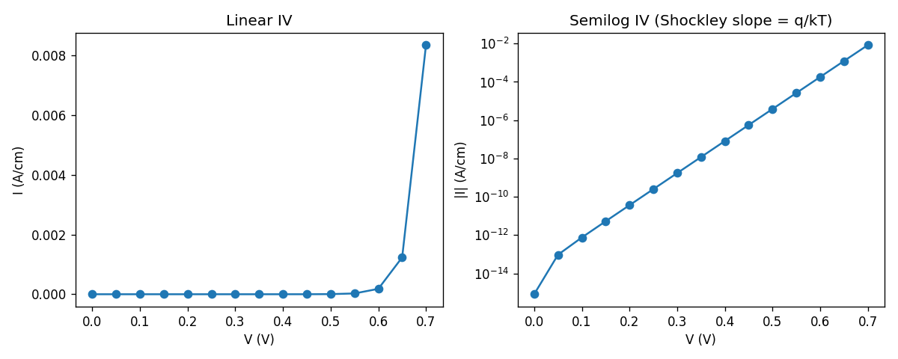

# OpenTCAD

**Open-source TCAD framework for semiconductor process and device simulation.**

OpenTCAD is a modular Python framework that connects process simulation
(topography, implant, diffusion) to device simulation (drift-diffusion,
Poisson) in a single, reproducible pipeline. It is built on a stack of
mature open libraries:

| Layer               | Backend                                |
| ------------------- | -------------------------------------- |
| Meshing             | [Gmsh](https://gmsh.info)              |
| Topography (planned)| [ViennaPS](https://viennatools.github.io/) |
| Diffusion (planned) | [FiPy](https://www.ctcms.nist.gov/fipy/) |
| Device solver       | [DEVSIM](https://devsim.org)           |
| Visualization       | [PyVista](https://pyvista.org)         |

The goal is to provide an end-to-end Python API where a single script can
define a structure, simulate fabrication, extract a device mesh, and
produce IV / CV / Vth characteristics — all with first-class data
provenance.

---

## Status

OpenTCAD is in **Phase 0**: device simulation on hand-specified
structures. The current release is suitable for research, teaching, and
prototyping. See [PHASES.md](PHASES.md) for the full roadmap.

| Phase | Scope                                    | Status         |
| ----- | ---------------------------------------- | -------------- |
| 0     | Geometry DSL + DEVSIM device simulation  | **In progress**|
| 1     | ViennaPS topography (etch / dep / oxide) | Planned        |
| 2     | Implant + diffusion (FiPy)               | Planned        |
| 3     | Materials calibration vs. SKY130 / IHP   | Planned        |

What works today:
- 2D geometry builder (`Structure` DSL) → Gmsh triangular mesh
- Multi-region structures with material interfaces (e.g. Si/SiO₂)
- Drift-diffusion + Poisson via DEVSIM with Scharfetter–Gummel flux
- SRH recombination, constant mobility, ohmic and metal-on-insulator contacts
- IV sweeps, MOS-capacitor regime analysis
- YAML-based material parameter database (with `pydantic` validation)

Phase 0 exit criterion: p-n junction IV within 5% of Shockley
(✓ achieved) and 2D MOSFET threshold behavior correct (✓ MOS capacitor;
full MOSFET in progress).

---

## Architecture

Every layer communicates through a single data object — the **`MeshField`**
— a thin wrapper around a `pyvista.UnstructuredGrid` carrying:

- per-cell `material_id` (from the `Material` enum)
- per-point doping (`Nd`, `Na` in cm⁻³)
- a list of named electrical contacts (`ContactTag`)
- a `ProcessStep` history for provenance

```
                ┌──────────────────────────────────────────────┐
                │     opentcad.geometry.Structure (DSL)        │
                │  add_substrate / add_layer / add_region /    │
                │  add_contact                                 │
                └────────────────────┬─────────────────────────┘
                                     │ .to_meshfield()
                                     ▼
   ┌──────────────────────────────────────────────────────────┐
   │  MeshField  ─  pyvista UnstructuredGrid                  │
   │   cells:  material_id                                    │
   │   nodes:  Nd, Na                                         │
   │   tags :  ContactTag, ProcessStep                        │
   └─────┬──────────────────────────┬─────────────────────────┘
         │                          │
  (Phase 1–2)                       │ (Phase 0)
  ViennaPS / FiPy                   ▼
  process simulation     ┌────────────────────────────────────┐
         │               │  opentcad.device.DeviceSolver      │
         └──────────────▶│  DEVSIM  ·  Poisson + DD + SRH     │
                         │  iv_sweep / solve_equilibrium      │
                         └────────────────────────────────────┘
                                     │
                                     ▼
                              VTK / matplotlib
```

**Units are enforced everywhere**: spatial in micrometers (µm),
concentration in cm⁻³, temperature in Kelvin, energy in eV.
The DEVSIM bridge converts µm → cm internally; you never see that.

---

## Installation

OpenTCAD requires Python ≥ 3.10. The device solver depends on DEVSIM,
which ships as a binary wheel for Linux and macOS.

```bash
git clone https://github.com/abhineet-agarwal/opentcad.git
cd opentcad
python -m venv .venv
source .venv/bin/activate
pip install -e ".[dev]"
```

Verify the installation:

```bash
pytest tests/geometry -v          # no DEVSIM required
pytest tests/ -v -m "not slow"    # full test suite
```

---

## Tutorial 1 — A silicon p-n junction in 25 lines

Build a 1 µm × 1 µm symmetric p-n diode (Nₐ = N_d = 10¹⁷ cm⁻³),
mesh it, and sweep the forward bias from 0 V to 0.7 V:

```python
from opentcad.device.solver import DeviceSolver
from opentcad.geometry.formats import Material
from opentcad.geometry.structure import Structure
from opentcad.materials.database import load_material

structure = (Structure(width_um=1.0, name="pn_diode")
    .add_substrate("p", 0.5, Material.SI, doping_Na=1e17)
    .add_layer    ("n", 0.5, Material.SI, doping_Nd=1e17)
    .add_contact  ("anode",   0.0, 1.0, "p", surface="bottom")
    .add_contact  ("cathode", 0.0, 1.0, "n", surface="top"))

mesh = structure.to_meshfield(mesh_size_um=0.05)

solver = DeviceSolver(mesh, {"Silicon": load_material("Si")})
V, I   = solver.iv_sweep("anode", "cathode",
                         v_start=0.0, v_end=0.7, v_step=0.05)
```

The full version (with matplotlib plotting and an ideality-factor check
against the Shockley equation) lives at
[`examples/01_pn_junction.py`](examples/01_pn_junction.py):

```bash
python examples/01_pn_junction.py
```

You should see a textbook diode IV with a semilog slope of q/kT
(≈ 25.85 mV per decade at 300 K).



---

## Tutorial 2 — A MOS capacitor (heterogeneous regions)

Multi-region devices work the same way. Stack p-type silicon, a 5 nm
thermal oxide, and a metal gate contact; OpenTCAD automatically detects
the Si/SiO₂ interface and inserts a potential-continuity boundary
condition.

```python
from opentcad.device.solver import DeviceSolver
from opentcad.geometry.formats import Material
from opentcad.geometry.structure import Structure
from opentcad.materials.database import load_material

mos = (Structure(width_um=1.0, name="mos_cap")
    .add_substrate("body",  0.5,   Material.SI,   doping_Na=1e17)
    .add_layer    ("oxide", 0.005, Material.SIO2)              # 5 nm
    .add_contact  ("body",  0.0, 1.0, "body",  surface="bottom")
    .add_contact  ("gate",  0.0, 1.0, "oxide", surface="top"))

mf     = mos.to_meshfield(mesh_size_um=0.05)
solver = DeviceSolver(mf, {
    "Silicon": load_material("Si"),
    "SiO2"  : load_material("SiO2"),
})
solver.solve_equilibrium()
```

You can then sweep the gate bias and observe the three classical regimes
(accumulation, depletion, strong inversion). A worked test that asserts
the surface potential saturates near 2·φ_F at strong inversion is in
[`tests/device/test_mos_capacitor.py`](tests/device/test_mos_capacitor.py).

---

## Concepts

### The `Structure` DSL

`Structure` describes a 2D cross-section as an ordered layer stack plus
optional rectangular region overrides:

| Method            | Purpose                                                 |
| ----------------- | ------------------------------------------------------- |
| `add_substrate`   | First (bottom) layer                                    |
| `add_layer`       | Stack a layer on top                                    |
| `add_region`      | Override material/doping in a rectangle (e.g. S/D wells)|
| `add_contact`     | Tag a span of nodes on the top or bottom surface        |
| `to_meshfield`    | Generate the Gmsh mesh and return a `MeshField`         |

The mesh is automatically refined at material interfaces; you can tune
the global element size via `mesh_size_um`.

### The `MeshField` data contract

Every module boundary in OpenTCAD passes a `MeshField`. There is no
raw-numpy interface between layers — this guarantees that geometry,
doping, contact, and provenance information stay together.

```python
mf.material_ids        # ndarray[int], one per cell
mf.Nd, mf.Na           # ndarray[float], cm^-3, per node
mf.get_contact("gate") # ContactTag
mf.save("device.vtu")  # VTK + sidecar JSON metadata
MeshField.load("device.vtu")
```

### Materials

Material parameters live as YAML files in
[`opentcad/materials/params/`](opentcad/materials/params/). Each file
specifies bandgap, effective densities of states, mobility, SRH
lifetimes, and (for insulators) the `is_insulator: true` flag that puts
the region in Poisson-only mode. Add a new material by dropping in a new
YAML file.

```python
from opentcad.materials.database import load_material
si  = load_material("Si")
ox  = load_material("SiO2")
print(si.mobility_constant.electron_cm2_Vs)   # 1350.0
```

---

## Project layout

```
opentcad/
├── geometry/      Structure DSL, Gmsh meshing, MeshField data format
├── process/       (Phase 1–2) ViennaPS topography, implant, diffusion
├── device/        DEVSIM wrapper, physics models, contact BCs
├── materials/     YAML parameter database + loader
├── bridge/        Process → device mesh handoff (field interpolation)
├── io/            VTK / GDS file I/O
└── viz/           Plotting helpers

examples/          Runnable tutorial scripts
tests/             Pytest suite (markers: slow, requires_devsim, integration)
PHASES.md          Phased roadmap with exit criteria per phase
```

---

## Testing

```bash
pytest tests/ -v                         # full suite
pytest tests/geometry/ -v                # no DEVSIM/ViennaPS needed
pytest -m "not slow" -v                  # skip slow tests
pytest -m requires_devsim -v             # only DEVSIM-backed tests
```

Test markers are declared in
[`pyproject.toml`](pyproject.toml) under `[tool.pytest.ini_options]`.

---

## Roadmap

See [PHASES.md](PHASES.md) for full milestone descriptions. Highlights:

- **Phase 1** — ViennaPS-backed topography (etch, deposition, oxidation
  with Deal-Grove moving boundary), exit criterion: LOCOS isolation
  structure correct, gate oxide within 5%.
- **Phase 2** — Implant (Pearson IV) + FiPy diffusion with the
  process → device mesh translator. Exit criterion: full NMOS process
  flow with Vth within 20% of SKY130.
- **Phase 3** — Quantitative calibration vs. SKY130 / IHP SG13G2 PDKs:
  Klaassen / Lombardi / Canali mobility, surface mobility, BGN.
- **Phase 4** — NEGF backend via NanoTCAD ViDES, GDS import, Sphinx docs.

---

## Contributing

Contributions are welcome — particularly new material YAML files (with
citations), example notebooks, and DEVSIM physics models. Please:

1. Open an issue describing the change before large refactors.
2. Add tests covering new behavior (`pytest -v` must pass).
3. Run `ruff check .` and keep public APIs documented with docstrings.

---

## License

Apache License 2.0 — see [LICENSE](LICENSE). OpenTCAD wraps several
permissively-licensed open-source projects (Gmsh GPLv2 with linking
exception, DEVSIM Apache 2.0, FiPy public domain, ViennaPS MIT,
PyVista MIT); each retains its own license.

## Citation

If you use OpenTCAD in academic work, please cite the upstream tools
(DEVSIM, Gmsh, ViennaPS, FiPy) in addition to this repository.
