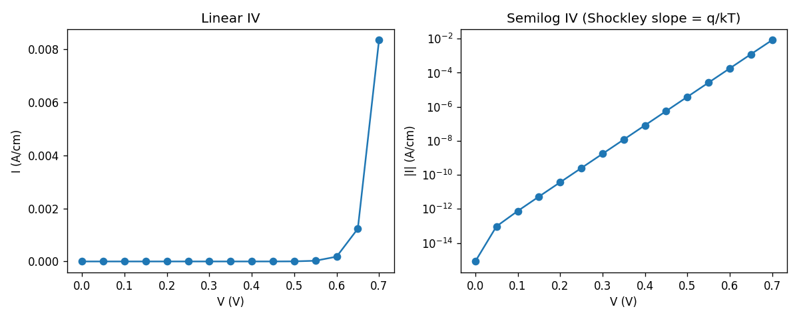
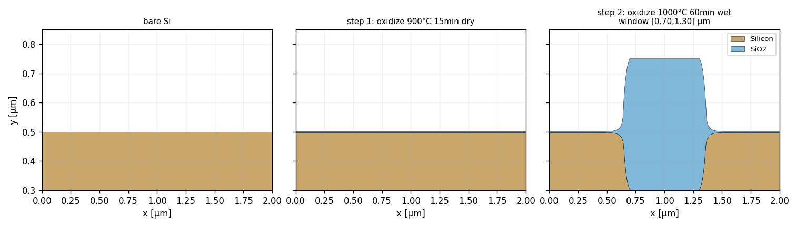

# OpenTCAD

**Open-source TCAD framework for semiconductor process and device simulation.**

OpenTCAD is a modular Python framework that connects process simulation
(topography, implant, diffusion) to device simulation (drift-diffusion,
Poisson) in a single, reproducible pipeline. It is built on a stack of
mature open libraries:

| Layer               | Backend                                |
| ------------------- | -------------------------------------- |
| Meshing             | [Gmsh](https://gmsh.info)              |
| Topography          | [ViennaLS](https://viennatools.github.io/) (level sets) |
| Diffusion (planned) | [FiPy](https://www.ctcms.nist.gov/fipy/) |
| Device solver       | [DEVSIM](https://devsim.org)           |
| Visualization       | [PyVista](https://pyvista.org)         |

The goal is to provide an end-to-end Python API where a single script can
define a structure, simulate fabrication, extract a device mesh, and
produce IV / CV / Vth characteristics — all with first-class data
provenance.

---

## Status

Phases 0 and 1 are complete: process topography (deposit, etch,
oxidation) and device simulation both work end-to-end and are joined
by a single `MeshField` data contract. The current release is
suitable for research, teaching, and prototyping. See
[PHASES.md](PHASES.md) for the full roadmap.

| Phase | Scope                                        | Status         |
| ----- | -------------------------------------------- | -------------- |
| 0     | Geometry DSL + DEVSIM device simulation      | **Complete**   |
| 1     | Topography (ViennaLS): deposit + etch + Deal-Grove oxidation | **Complete** |
| 2     | Implant + diffusion (FiPy)                   | Planned        |
| 3     | Materials calibration vs. SKY130 / IHP       | Planned        |

**Test count**: 94/94 passing (device solver + physics + geometry +
materials + topography). Slow ViennaLS-backed topography tests run in
under 10 s on a laptop.

### Device simulation (Phase 0)

- 2-D `Structure` DSL → adaptive Gmsh triangular mesh with
  per-material and per-region overrides (e.g. Si/SiO₂ stacks, n+ S/D
  wells in a p-body).
- Poisson + drift–diffusion via DEVSIM with Scharfetter–Gummel flux,
  automatic Jacobians, and continuous Si/SiO₂ interface conditions.
- Ohmic, Schottky, and metal-on-insulator contacts. `flat_band_shift_V`
  packs Q_f, mid-gap D_it, and φ_MS into one compact-model number.
- Full CMOS mobility stack composable in one expression —
  `Lombardi(base=Canali(base=Klaassen()))` — plus recombination
  (SRH + Auger + Radiative), bandgap narrowing (Slotboom), and
  Fermi–Dirac statistics (Blakemore).
- Analysis: `iv_sweep`, `cv_sweep` (quasi-static / low-frequency),
  MOS-cap regime probes, NMOS Id–Vgs.
- YAML-based material parameter database with `pydantic` validation.

Phase 0 exit criteria (all met):

- ✓ 1-D p-n junction IV within 5 % of Shockley
- ✓ 2-D MOS capacitor — three regimes, φ_s ≈ 2·φ_F at strong inversion
- ✓ 2-D NMOS Id–Vgs — clean turn-on, on/off > 10¹⁰ at V_ds = 50 mV
- ✓ MOS-cap LF CV — accumulation → C_ox, depletion minimum, LF
  inversion recovery to C_ox

### Topography simulation (Phase 1)

- Chainable `Recipe` DSL:
  `Recipe().deposit(material, thickness).etch(depth, ...).oxidize(...)`.
- Deposit models: conformal (Minkowski dilation via ViennaLS
  `GeometricAdvect` + `SphereDistribution`).
- Etch models:
  - unmasked isotropic — closed-form Minkowski erosion
  - **masked isotropic** — Lax–Friedrichs advection, textbook
    quarter-circle undercut under the mask edges
  - **masked directional (RIE)** — configurable ion-beam `direction`
    and `sidewall_ratio`; near-vertical trench walls at
    `sidewall_ratio=0`, intermediate profiles for chemical–physical
    mixes.
- Multi-material stacks: a deep masked etch punches through a top
  layer and continues into the material beneath it, via ViennaLS
  multi-level-set advection. Enables hardmask patterning flows.
- **Deal–Grove thermal oxidation**: closed-form linear-parabolic law
  with Arrhenius fits for dry O₂ and wet H₂O on ⟨100⟩ Si. Per-column
  moving boundary — Si consumed downward by 0.44 · Δx, SiO₂ top up
  by 0.56 · Δx. Optional mask window with an exponential bird's-beak
  feathering length, enough for a qualitative LOCOS profile.
- **Zero-glue device coupling**: `topography_to_meshfield` produces a
  standard `MeshField` that `DeviceSolver` consumes unchanged — no
  process-side re-meshing, no manual doping insertion.

Phase 1 exit criteria (all met):

- ✓ LOCOS isolation profile — pad oxide, masked field oxide, bird's
  beak visible in the meshed structure
  ([`examples/05_locos.py`](examples/05_locos.py))
- ✓ Gate-oxide thickness within 5 % of Deal–Grove across dry+wet
  ambients at 1000–1100 °C (verified in `test_oxidation.py`)

See [`examples/04_topography_hello.py`](examples/04_topography_hello.py)
for a side-by-side isotropic-vs-directional trench comparison plus a
two-material through-etch demo, and
[`examples/05_locos.py`](examples/05_locos.py) for the LOCOS flow.

**Backend note (macOS)**: OpenTCAD talks to ViennaLS directly rather
than through ViennaPS, because the current ViennaPS macOS wheel
statically links VTK and its duplicate `vtkCocoa*` classes collide with
ViennaLS's copy, segfaulting on any real op. The ViennaPS process-model
catalog (SF6O2Etching, MultiParticleProcess, …) plugs in when a fixed
wheel ships — the Recipe / mesh-bridge boundaries won't move.

---

## Architecture

Every layer communicates through a single data object — the **`MeshField`**
— a thin wrapper around a `pyvista.UnstructuredGrid` carrying:

- per-cell `material_id` (from the `Material` enum)
- per-point doping (`Nd`, `Na` in cm⁻³)
- a list of named electrical contacts (`ContactTag`)
- a `ProcessStep` history for provenance

```
   ┌──────────────────────────────────────────────┐    ┌──────────────────────────────┐
   │   opentcad.geometry.Structure (DSL)          │    │   opentcad.process.Recipe    │
   │  add_substrate / add_layer / add_region /    │    │  .deposit(material, t)       │
   │  add_contact                                 │    │  .etch(depth, model=...,     │
   │                                              │    │        window_x_um=...)      │
   └────────────────────┬─────────────────────────┘    └────────────┬─────────────────┘
                        │ .to_meshfield()                           │ simulate(struct, recipe)
                        │                                           ▼
                        │                             ┌───────────────────────────────┐
                        │                             │  ViennaLS multi-LS advection  │
                        │                             │  (per-layer level-sets)       │
                        │                             └────────────┬──────────────────┘
                        │                                          │ topography_to_meshfield
                        ▼                                          ▼
   ┌──────────────────────────────────────────────────────────────────────────────────┐
   │  MeshField  ─  pyvista UnstructuredGrid                                          │
   │   cells:  material_id                                                            │
   │   nodes:  Nd, Na                                                                 │
   │   tags :  ContactTag, ProcessStep                                                │
   └────────────────────────────────────────────┬─────────────────────────────────────┘
                                                │
                                                ▼
                              ┌────────────────────────────────────────┐
                              │  opentcad.device.DeviceSolver          │
                              │  DEVSIM · Poisson + DD                 │
                              │  Klaassen · Canali · Lombardi · SRH …  │
                              │  iv_sweep · cv_sweep · equilibrium     │
                              └────────────────────┬───────────────────┘
                                                   │
                                                   ▼
                                            VTK / matplotlib
```

**Units are enforced everywhere**: spatial in micrometers (µm),
concentration in cm⁻³, temperature in Kelvin, energy in eV.
The DEVSIM bridge converts µm → cm internally; you never see that.

---

## Installation

OpenTCAD requires Python ≥ 3.10. The device solver depends on DEVSIM,
which ships as a binary wheel for Linux and macOS.

```bash
git clone https://github.com/abhineet-agarwal/opentcad.git
cd opentcad
python -m venv .venv
source .venv/bin/activate
pip install -e ".[dev]"
```

Verify the installation:

```bash
pytest tests/geometry -v          # no DEVSIM required
pytest tests/ -v -m "not slow"    # full test suite
```

### Optional: Streamlit GUI

An interactive browser UI walks through the whole pipeline
(Structure → Recipe → MeshField → IV/CV) with per-section live previews:

```bash
pip install -e ".[gui]"
streamlit run opentcad/gui/app.py
```

Opens `http://localhost:8501`. Session state carries the built objects
between sections; a sidebar "Reset entire pipeline" button clears
everything.

---

## Tutorial 1 — A silicon p-n junction in 25 lines

Build a 1 µm × 1 µm symmetric p-n diode (Nₐ = N_d = 10¹⁷ cm⁻³),
mesh it, and sweep the forward bias from 0 V to 0.7 V:

```python
from opentcad.device.solver import DeviceSolver
from opentcad.geometry.formats import Material
from opentcad.geometry.structure import Structure
from opentcad.materials.database import load_material

structure = (Structure(width_um=1.0, name="pn_diode")
    .add_substrate("p", 0.5, Material.SI, doping_Na=1e17)
    .add_layer    ("n", 0.5, Material.SI, doping_Nd=1e17)
    .add_contact  ("anode",   0.0, 1.0, "p", surface="bottom")
    .add_contact  ("cathode", 0.0, 1.0, "n", surface="top"))

mesh = structure.to_meshfield(mesh_size_um=0.05)

solver = DeviceSolver(mesh, {"Silicon": load_material("Si")})
V, I   = solver.iv_sweep("anode", "cathode",
                         v_start=0.0, v_end=0.7, v_step=0.05)
```

The full version (with matplotlib plotting and an ideality-factor check
against the Shockley equation) lives at
[`examples/01_pn_junction.py`](examples/01_pn_junction.py):

```bash
python examples/01_pn_junction.py
```

You should see a textbook diode IV with a semilog slope of q/kT
(≈ 25.85 mV per decade at 300 K).



---

## Tutorial 2 — A MOS capacitor (heterogeneous regions)

Multi-region devices work the same way. Stack p-type silicon, a 5 nm
thermal oxide, and a metal gate contact; OpenTCAD automatically detects
the Si/SiO₂ interface and inserts a potential-continuity boundary
condition.

```python
from opentcad.device.solver import DeviceSolver
from opentcad.geometry.formats import Material
from opentcad.geometry.structure import Structure
from opentcad.materials.database import load_material

mos = (Structure(width_um=1.0, name="mos_cap")
    .add_substrate("body",  0.5,   Material.SI,   doping_Na=1e17)
    .add_layer    ("oxide", 0.005, Material.SIO2)              # 5 nm
    .add_contact  ("body",  0.0, 1.0, "body",  surface="bottom")
    .add_contact  ("gate",  0.0, 1.0, "oxide", surface="top"))

mf     = mos.to_meshfield(mesh_size_um=0.05)
solver = DeviceSolver(mf, {
    "Silicon": load_material("Si"),
    "SiO2"  : load_material("SiO2"),
})
solver.solve_equilibrium()
```

You can then sweep the gate bias and observe the three classical regimes
(accumulation, depletion, strong inversion). A worked test that asserts
the surface potential saturates near 2·φ_F at strong inversion is in
[`tests/device/test_mos_capacitor.py`](tests/device/test_mos_capacitor.py).

---

## Tutorial 3 — A full 2-D NMOS Id–Vgs

`add_region` overrides material (and doping) inside a rectangle, so n+
source/drain wells can be poked through the gate-oxide layer to give the
S/D contacts something ohmic to attach to. The result is a real
four-terminal MOSFET:

```python
from opentcad.device.solver import DeviceSolver
from opentcad.geometry.formats import Material
from opentcad.geometry.structure import Structure
from opentcad.materials.database import load_material

W, L, T_OX = 2.0, 1.0, 0.005
nmos = (Structure(width_um=W, name="nmos")
    .add_substrate("p_body", 0.5,   Material.SI,   doping_Na=1e17)
    .add_layer    ("oxide",  T_OX,  Material.SIO2)
    .add_region   ("source", 0.0, 0.5, 0.4, 0.5 + T_OX, Material.SI, doping_Nd=1e20)
    .add_region   ("drain",  W-0.5, W, 0.4, 0.5 + T_OX, Material.SI, doping_Nd=1e20)
    .add_contact  ("source", 0.0, 0.5,             "oxide", surface="top")
    .add_contact  ("drain",  W-0.5, W,             "oxide", surface="top")
    .add_contact  ("gate",   0.5, 0.5+L,           "oxide", surface="top")
    .add_contact  ("body",   0.0, W,               "p_body", surface="bottom"))

mf     = nmos.to_meshfield(mesh_size_um=0.03)
solver = DeviceSolver(mf, {"Silicon": load_material("Si"),
                           "SiO2"   : load_material("SiO2")})
solver.solve_equilibrium()
# Set Vds = 50 mV, then sweep Vgs — see tests/device/test_nmos_idvg.py
```

Sweeping Vgs from 0 V to 1.5 V at Vds = 50 mV gives a textbook Id–Vgs
curve with on/off ratio ≈ 10¹⁰, monotonic turn-on, and the threshold
visible as a knee in the curve near ~0.7 V (matching the MOS-cap
analytic Vth ≈ 0.85 V for Nₐ = 10¹⁷).

---

## Tutorial 4 — A curved trench from a masked etch

The topography DSL runs process steps on a ViennaLS level-set and hands
you a `MeshField` you can feed straight back into `DeviceSolver`. The
following recipe starts with a bare Si substrate, blanket-etches 30 nm,
then opens a 300 nm window in the mask and isotropically etches 150 nm.
The result is the textbook quarter-circle profile:

```python
from opentcad.geometry.formats import Material
from opentcad.geometry.structure import Structure
from opentcad.process.topography import (
    Recipe, simulate, topography_to_meshfield,
)

struct = (Structure(width_um=1.0, name="trench")
    .add_substrate("body", 0.5, Material.SI))

recipe = (Recipe("curved_trench")
    .etch(0.03)                                   # blanket 30 nm
    .etch(0.15, window_x_um=(0.35, 0.65)))        # 150 nm through mask

state = simulate(struct, recipe, grid_delta_um=0.005)
mf    = topography_to_meshfield(state, mesh_size_um=0.03)
```

Swap `.etch(depth, window_x_um=..., model="directional")` for the RIE
variant with near-vertical sidewalls, or `.etch(depth, ...,
model="directional", sidewall_ratio=0.4)` for an intermediate profile.
[`examples/04_topography_hello.py`](examples/04_topography_hello.py)
runs both models under the same window and produces:

- `examples/04_topography_recipe.png` — recipe progression per step
  for both isotropic and directional, in a 2×3 grid.
- `examples/04_topography_profile.png` — the two final profiles
  overlaid so you can read the undercut off directly.
- `examples/04_topography_mesh.png` — the final MeshField shaded by
  material, ready for the device solver.

For multi-material patterning (say, a directional etch through a
30 nm SiO₂ hardmask into the Si substrate), just start with a
stacked `Structure`:

```python
struct = (Structure(width_um=1.0, name="through_etch")
    .add_substrate("body", 0.5, Material.SI)
    .add_layer   ("oxide", 0.03, Material.SIO2))

recipe = Recipe("through").etch(
    0.15, model="directional", window_x_um=(0.35, 0.65))

state = simulate(struct, recipe, grid_delta_um=0.005)
mf    = topography_to_meshfield(state, mesh_size_um=0.02)
```

The etch consumes the oxide inside the window and continues into the Si
by the remaining depth; the mesh bridge splits each material into
whichever contiguous x-ranges still carry non-zero thickness. See
`examples/04_topography_through.png` for the result.

---

## Tutorial 5 — LOCOS field isolation (Phase 1 exit demo)

Deal–Grove oxidation on bare Si follows the linear-parabolic law
x² + A·x = B(t + τ) with Arrhenius fits for A and B; OpenTCAD advects
the Si-top and SiO₂-top level-sets by 0.44·Δx and 0.56·Δx respectively
so each column's oxide growth conserves the physical volume ratio.
A single `.oxidize(T_C, t_s, ambient)` call is the whole recipe:

```python
recipe = Recipe("locos").oxidize(
    temperature_C=1000, time_s=3600, ambient="wet",
    window_x_um=(0.7, 1.3),         # nitride-mask opening
    bird_beak_length_um=0.03,       # lateral O2 diffusion tail
)
```

Running the full flow — thin pad oxide, then a wet field oxidation
inside a photolith window — reproduces the classic LOCOS profile:
thick SiO₂ mesa in the active area, tapered "bird's beak" at each
mask edge, unetched Si below. The full script lives at
[`examples/05_locos.py`](examples/05_locos.py):

```bash
python examples/05_locos.py
```

It produces two PNGs: a step-by-step stack view
(`examples/05_locos_profile.png`) and the final triangulated
`MeshField` shaded per material (`examples/05_locos_mesh.png`, ~85 k
triangles, ready for `DeviceSolver`).

The Phase 1 exit criterion — SiO₂ thickness within 5 % of the analytic
Deal–Grove prediction — is verified in
[`tests/process/test_oxidation.py`](tests/process/test_oxidation.py)
across dry+wet ambients at 1000–1100 °C.



---

## Concepts

### The `Structure` DSL

`Structure` describes a 2D cross-section as an ordered layer stack plus
optional rectangular region overrides:

| Method            | Purpose                                                 |
| ----------------- | ------------------------------------------------------- |
| `add_substrate`   | First (bottom) layer                                    |
| `add_layer`       | Stack a layer on top                                    |
| `add_region`      | Override material/doping in a rectangle (e.g. S/D wells)|
| `add_contact`     | Tag a span of nodes on the top or bottom surface        |
| `to_meshfield`    | Generate the Gmsh mesh and return a `MeshField`         |

The mesh is automatically refined at material interfaces; you can tune
the global element size via `mesh_size_um`.

### The `Recipe` DSL and topography engine

`Recipe` describes an ordered process flow — pure data, no backend
coupling. `simulate(structure, recipe)` plays it against an initial
`TopographyState` (built from the substrate + any pre-existing layers
in `Structure`) using ViennaLS level-sets:

| Method                                            | Purpose                                                             |
| ------------------------------------------------- | ------------------------------------------------------------------- |
| `deposit(material, thickness_um)`                 | Conformal Minkowski-dilation of the surface                         |
| `etch(depth_um)`                                  | Blanket isotropic erosion                                           |
| `etch(depth_um, window_x_um=(x0, x1))`            | Masked isotropic etch — quarter-circle undercut                     |
| `etch(depth_um, model="directional", ...)`        | Masked / unmasked RIE — near-vertical walls at `sidewall_ratio=0`   |
| `oxidize(T_C, t_s, ambient, window_x_um=..., bird_beak_length_um=...)` | Deal–Grove growth with per-column moving boundary + optional LOCOS-style mask |

`topography_to_meshfield(state, mesh_size_um=...)` extracts each
layer's top-surface polyline via `ToSurfaceMesh`, clamps to the
physical stack invariant, splits every layer into the x-ranges where
it still has non-zero thickness, and hands the resulting polygons to
gmsh for a triangulation tagged per material.

### The `MeshField` data contract

Every module boundary in OpenTCAD passes a `MeshField`. There is no
raw-numpy interface between layers — this guarantees that geometry,
doping, contact, and provenance information stay together.

```python
mf.material_ids        # ndarray[int], one per cell
mf.Nd, mf.Na           # ndarray[float], cm^-3, per node
mf.get_contact("gate") # ContactTag
mf.save("device.vtu")  # VTK + sidecar JSON metadata
MeshField.load("device.vtu")
```

### Materials

Material parameters live as YAML files in
[`opentcad/materials/params/`](opentcad/materials/params/). Each file
specifies bandgap, effective densities of states, mobility, SRH
lifetimes, and (for insulators) the `is_insulator: true` flag that puts
the region in Poisson-only mode. Add a new material by dropping in a new
YAML file.

```python
from opentcad.materials.database import load_material
si  = load_material("Si")
ox  = load_material("SiO2")
print(si.mobility_constant.electron_cm2_Vs)   # 1350.0
```

### Physics models

`DeviceSolver` takes an optional `PhysicsConfig` that bundles the
mobility, recombination, etc. models to use. Mobility is a single
model; recombination is a list of contributors (their rates are
summed).

```python
from opentcad.device.physics import PhysicsConfig
from opentcad.device.models import Klaassen, SRH, Auger, Radiative

solver = DeviceSolver(mf, mat_params,
                      physics=PhysicsConfig(
                          mobility=Klaassen(),
                          recombination=[SRH(), Auger(), Radiative()]))
```

Available today:

| Kind | Model | Notes |
|---|---|---|
| Mobility | `ConstantMobility` | default; YAML `mobility_constant` values |
| Mobility | `Klaassen` | unified low-field bulk mobility (1992) with clustering + carrier-carrier scattering |
| Mobility | `Canali` | high-field velocity saturation; wraps any base model (composes with `Klaassen`) |
| Mobility | `Lombardi` | surface mobility at Si/SiO₂ interfaces; wraps any base model; Matthiessen composition of bulk + acoustic-phonon + surface-roughness |
| Recombination | `SRH` | default; mid-gap trap |
| Recombination | `Auger` | Dziewior-Schmid; dominates over SRH for n,p > ~10¹⁸ cm⁻³ |
| Recombination | `Radiative` | negligible in Si; central for GaAs/GaN |
| BGN | `NoBGN` | default; disables bandgap narrowing |
| BGN | `Slotboom` | doping-dependent Eg narrowing; raises n_i_eff in n+/p+ regions |
| Contact BC | `contact_type="ohmic"` | default; charge-neutral semiconductor contact |
| Contact BC | `contact_type="schottky"` | metal-semi barrier; requires `work_function_eV`; rectifies |
| Contact BC | `flat_band_shift_V` | metal-on-insulator Vfb offset; packs Qf, midgap Dit, and phi_MS in one number |
| Statistics | `Boltzmann` | default; classical Maxwell-Boltzmann |
| Statistics | `FermiDirac` | Blakemore approximation; captures degeneracy at heavy doping (n → N_c) |

The full CMOS mobility stack — bulk doping-dep + high-field saturation +
surface degradation — composes in a single expression:

```python
physics = PhysicsConfig(
    mobility=Lombardi(base=Canali(base=Klaassen())),
    recombination=[SRH(), Auger()],
    bgn=Slotboom())
```

Klaassen's µ_n on uniformly-doped Si at 300 K:

| Nd (cm⁻³) | µ_n (cm²/V/s) |
|----------:|--------------:|
| 10¹⁵      | 1359          |
| 10¹⁶      | 1177          |
| 10¹⁷      | 727           |
| 10¹⁸      | 284           |
| 10¹⁹      | 108           |

Adding new physics is one new file under
[`opentcad/device/models/`](opentcad/device/models/) that subclasses
the relevant base in `opentcad/device/physics.py`.

---

## Project layout

```
opentcad/
├── geometry/      Structure DSL, Gmsh meshing, MeshField data format
├── process/
│   └── topography/ Recipe DSL, ViennaLS simulator, level-set → mesh bridge
├── device/        DEVSIM wrapper, physics models, contact BCs
├── materials/     YAML parameter database + loader
├── bridge/        Process → device field interpolation (Phase 2)
├── io/            VTK / GDS file I/O
└── viz/           Plotting helpers

examples/          Runnable tutorial scripts + generated PNG plots
tests/             Pytest suite — 78 tests
                   (markers: slow, requires_devsim, requires_viennaps)
PHASES.md          Phased roadmap with exit criteria per phase
```

---

## Testing

```bash
pytest tests/ -v                         # full suite (78 tests, ~20 s)
pytest tests/geometry/ -v                # geometry-only (no DEVSIM/ViennaLS)
pytest tests/process/ -v                 # topography (requires viennals)
pytest -m "not slow" -v                  # skip slow tests
pytest -m requires_devsim -v             # only DEVSIM-backed tests
```

Test markers are declared in
[`pyproject.toml`](pyproject.toml) under `[tool.pytest.ini_options]`.

---

## Roadmap

See [PHASES.md](PHASES.md) for full milestone descriptions.

**Done**

- **Phase 0** — Geometry DSL + DEVSIM device simulation with p-n
  junction, MOS-cap, and NMOS Id–Vgs / CV as validated exit criteria.
- **Phase 1** — Topography DSL (`Recipe.deposit / etch / oxidize`)
  on ViennaLS: conformal deposit, isotropic + directional (RIE) etch,
  masked windowed etches, multi-material through-etch, Deal–Grove
  thermal oxidation with a per-column moving boundary, and a
  level-set → `MeshField` bridge that drops straight into the device
  solver. LOCOS + gate-oxide-within-5 % exit criteria met.

**Next**

- **Phase 2** — Implant (Pearson IV, B/P/As/BF₂) + FiPy diffusion
  driven by a `Recipe.implant / anneal` extension, with a process →
  device field translator that fills `Nd` / `Na` on the meshed device
  from the process-side profile. Exit: full NMOS process flow with
  Vth within 20 % of SKY130.
- **Phase 3** — Quantitative calibration vs. SKY130 / IHP SG13G2
  PDKs: scipy-driven fit of the existing physics knobs against target
  metrics (Vth, Ion, SS).
- **Phase 4** — NEGF backend via NanoTCAD ViDES, GDS import, Sphinx
  docs, community notebooks.

**Backlog / follow-ups noted in code**

- Angled directional etches (non-vertical ion beam direction).
- Proper polygon walker in the mesh bridge for re-entrant profiles
  (currently drops the overhang sliver at multi-valued x).
- Full 2D coupled O₂ diffusion for the LOCOS bird's-beak profile
  (currently an exponential heuristic feathering length).
- Per-material selectivity in etch rates for multi-material stacks
  (currently one global rate).
- Element-based E_normal for Lombardi surface mobility (currently
  ~3 % degradation instead of the textbook 20–40 %).
- Interface-Poisson Q_f as a physically-located surface charge, for CV
  curves with interface E-field discontinuities.
- Joyce–Dixon inverse for Fermi–Dirac statistics beyond the Blakemore
  ceiling (n > 3.7 · N_c).
- Small-signal AC via DEVSIM's circuit machinery for true HF-CV.

---

## Contributing

Contributions are welcome — particularly new material YAML files (with
citations), example notebooks, and DEVSIM physics models. Please:

1. Open an issue describing the change before large refactors.
2. Add tests covering new behavior (`pytest -v` must pass).
3. Run `ruff check .` and keep public APIs documented with docstrings.

---

## License

Apache License 2.0 — see [LICENSE](LICENSE). OpenTCAD wraps several
permissively-licensed open-source projects (Gmsh GPLv2 with linking
exception, DEVSIM Apache 2.0, FiPy public domain, ViennaLS MIT,
PyVista MIT); each retains its own license.

## Citation

If you use OpenTCAD in academic work, please cite the upstream tools
(DEVSIM, Gmsh, ViennaLS, FiPy) in addition to this repository.
